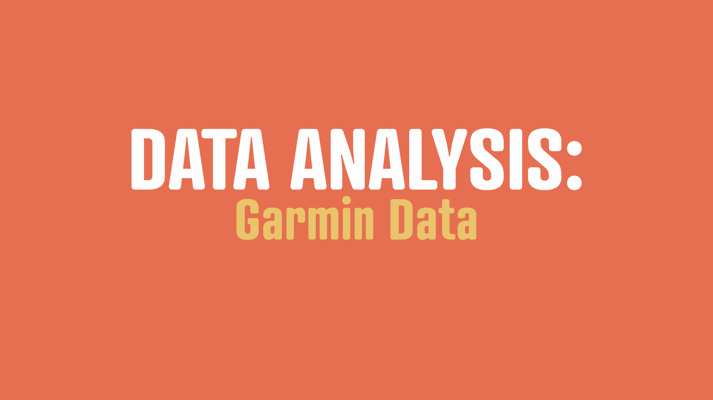

# Gramin_Data_Processing
Handle Garmin time, location and speed normalization.

The company Garmin headquartered in Schaffhausen, Switzerland, uses different data storage methods than what is standard. Because of this, their data requires some preprocessing to be utilized effectively in data science. This document will handle the Garmin time differences, semicircle conversion, and normalize the speed.
